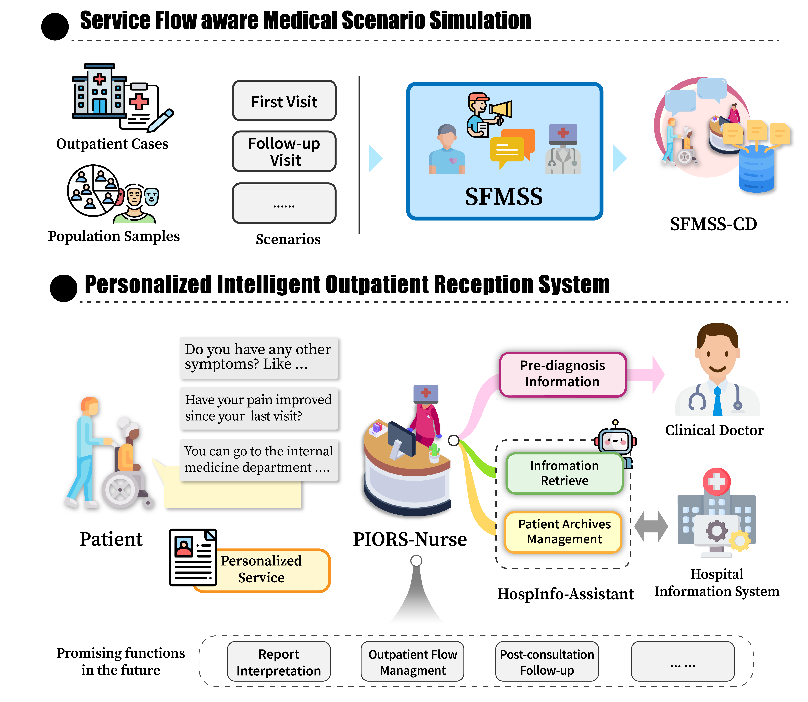
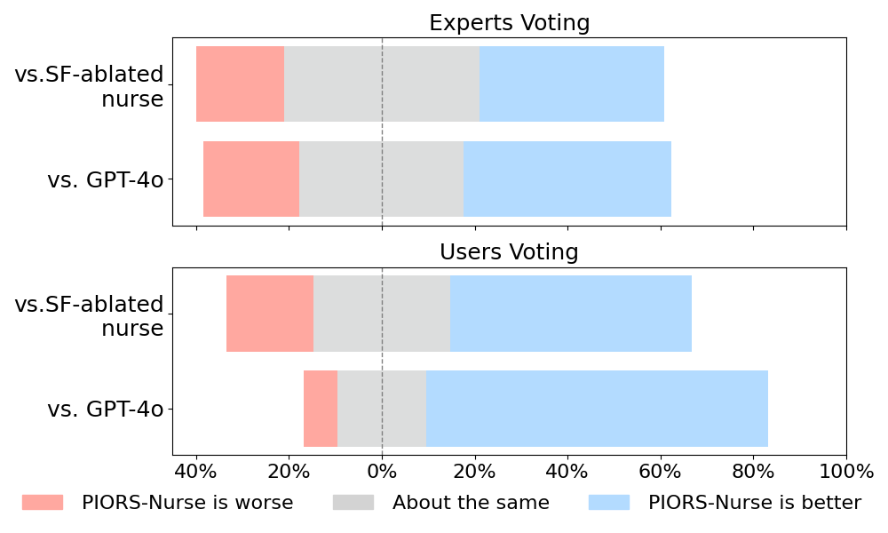

<div align="center">
<h1>SFMSS & PIORS</h1>

[Demo](https://piors.fudan-disc.com) | [Paper(SFMSS)](https://aclanthology.org/2025.findings-naacl.259/) | [Paper(PIORS)](https://arxiv.org/abs/2411.13902)

</div>

Implementation of NAACL 2025 paper _SFMSS: Service Flow aware Medical Scenario Simulation for Conversational Data Generation_.

The repo of the Personalized Intelligent Outpatient Reception System (PIORS).

## Overview
In China, receptionist nurses face overwhelming workloads in outpatient settings, limiting their time and attention for each patient and ultimately reducing service quality. 
We present the **Personalized Intelligent Outpatient Reception System (PIORS)**. This system integrates an LLM-based reception nurse and a collaboration between LLM and hospital information system (HIS) into real outpatient reception setting, aiming to deliver personalized, high-quality, and efficient reception services. Additionally, to enhance the performance of LLMs in real-world healthcare scenarios, we propose a medical conversational data generation framework named **Service Flow aware Medical Scenario Simulation (SFMSS)**, aiming to adapt the LLM to the real-world environments and PIORS settings. We evaluate the effectiveness of PIORS and SFMSS through automatic and human assessments involving 15 users and 15 clinical experts. The results demonstrate that PIORS-Nurse outperforms all baselines, including the current state-of-the-art model GPT-4o, and aligns with human preferences and clinical needs. 

The overall framework of PIORS is shown below.


## Setup
```bash
git clone https://github.com/FudanDISC/PIORS.git
cd PIORS
```
We provide an [`environment.yml`](environment.yml) file that can be used to create a Conda environment. 

```bash
conda env create -f environment.yml
conda activate piors
```
Change the placeholder `your api key` in [`eval_model_config`](eval/config/eval_model_config.json), [`judger_config`](eval/config/judger_config.json) and [`agent_config`](sfmss/config/agent_config.json) with your valid OpenAI api key (if you don't have one, refer to [OpenAI website](https://platform.openai.com/api-keys) to generate one).

## Quick Start
- Click [here](https://piors.fudan-disc.com) to try the demo of PIORS.
- Below we provide quick examples of SFMSS and the automatic evaluation.
### Dialogue Simulation with SFMSS
We provide few example outpatient medical records in [`emr_example.json`](sfmss/data/emr/emr_example.json), you can use them as seed data to simulation outpatient receptino dialogues.

```bash
bash sfmss/main.sh
```

You can also use your own medical records dataset to start dialogue simulation. Just change `FILE_PATH` to the path to your dataset and make sure that the data format meets the requirements. Detailed instructions and specific data format requirements can be found [here](sfmss/README.md).

### Evaluation
You can evaluate the performance of a model acting as a reception nurse. By default, the evaluation assesses the performance of GPT-4o, and the [emr_example.json](sfmss/data/emr/emr_example.json) for patient simulator.

```bash
bash eval/main.sh
```

Change `Nurse` in [`eval_model_config`](eval/config/eval_model_config.json) to evaluate different models, and we recommend deploying local models using vLLM.

Details of the evaluation pipeline can be found [here](eval/README.md).

## Evaluation Results
We conduct both automatic and human evaluation. Our model (PIORS-Nurse) ranks first in all metrics in the automatic evaluation.
<table>
  <thead>
    <tr>
      <th>Method</th>
      <th>Model</th>
      <th>Accuracy</th>
      <th>Overall Score</th>
      <th>Info Score</th>
      <th>Average Turn Number</th>
      <th>Average Turn Length</th>
    </tr>
  </thead>
  <tbody>
    <tr>
      <td rowspan="4">Directly Prompt</td>
      <td><strong>GPT-4o</strong></td>
      <td>0.717</td>
      <td>3.83</td>
      <td>2.16</td>
      <td>3.54</td>
      <td>207.98</td>
    </tr>
    <tr>
      <td><strong>Qwen2-7B</strong></td>
      <td>0.634</td>
      <td>3.65</td>
      <td>2.28</td>
      <td>4.22</td>
      <td>336.40</td>
    </tr>
    <tr>
      <td><strong>Llama3-8B</strong></td>
      <td>0.401</td>
      <td>3.24</td>
      <td>2.65</td>
      <td>4.44</td>
      <td>678.14</td>
    </tr>
    <tr>
      <td><strong>HuatouGPT2-13B</strong></td>
      <td>0.501</td>
      <td>3.25</td>
      <td>2.17</td>
      <td>3.57</td>
      <td>258.38</td>
    </tr>
    <tr>
      <td rowspan="2">Fine-tuned</td>
      <td><strong>SF-ablated nurse</strong></td>
      <td>0.786</td>
      <td>3.92</td>
      <td>2.20</td>
      <td>3.37</td>
      <td>202.55</td>
    </tr>
    <tr>
      <td><strong>PIORS-Nurse</strong></td>
      <td><strong>0.822</strong></td>
      <td><strong>4.01</strong></td>
      <td><strong>3.01</strong></td>
      <td><strong>3.22</strong></td>
      <td><strong>139.54</strong></td>
    </tr>
  </tbody>
</table>


In human evaluation, our model achieves a win or tie rate of over 80%.



## Citation
```
@inproceedings{bao-etal-2025-sfmss,
    title = "{SFMSS}: Service Flow aware Medical Scenario Simulation for Conversational Data Generation",
    author = "Bao, Zhijie  and
      Liu, Qingyun  and
      Huang, Xuanjing  and
      Wei, Zhongyu",
    editor = "Chiruzzo, Luis  and
      Ritter, Alan  and
      Wang, Lu",
    booktitle = "Findings of the Association for Computational Linguistics: NAACL 2025",
    month = apr,
    year = "2025",
    address = "Albuquerque, New Mexico",
    publisher = "Association for Computational Linguistics",
    url = "https://aclanthology.org/2025.findings-naacl.259/",
    pages = "4586--4604",
    ISBN = "979-8-89176-195-7"
}


@misc{bao2024piors,
    title={PIORS: Personalized Intelligent Outpatient Reception based on Large Language Model with Multi-Agents Medical Scenario Simulation},
    author={Zhijie Bao and Qingyun Liu and Ying Guo and Zhengqiang Ye and Jun Shen and Shirong Xie and Jiajie Peng and Xuanjing Huang and Zhongyu Wei},
    year={2024},
    eprint={2411.13902},
    archivePrefix={arXiv},
    primaryClass={cs.CL}
}
```
